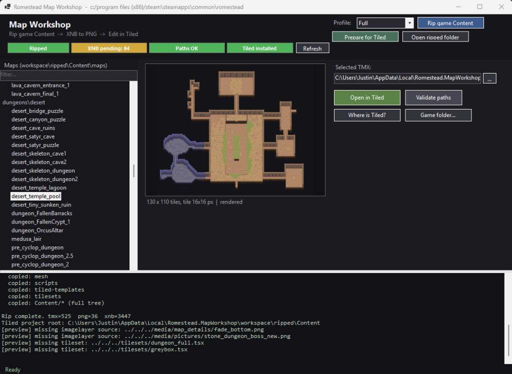

# Romestead Map Workshop



*v0.1 preview - feedback welcome, not a UI expert.*

Unofficial map editor for [Romestead](https://store.steampowered.com/app/1805320/Romestead/).
Rips your game's `Content/` into a local workspace, converts XNB textures to PNG,
fixes tileset paths, previews maps, and opens them in Tiled - without modifying
your game install.

> **Preview (v0.1):** Map packing / in-game mod install is not included yet. You can
> rip, preview, and edit in [Tiled](https://www.mapeditor.org/) today.

## Features

- **Status pills** showing whether you've ripped the game Content, converted
  XNB textures to PNG, fixed tileset paths, and have Tiled installed.
- **Searchable map tree** rooted at your ripped `maps/` folder.
- **In-app preview** - composites tile layers from `.tsx` tilesets *and* image
  layers, matching how Tiled renders the map. Handles CSV and base64+zlib/gzip
  layer encodings, plus tile flip flags.
- **One-click "Open in Tiled"** - automatically runs XNB→PNG conversion and
  tileset-path repair before launching Tiled, so the map opens with all
  tilesets resolved.
- **Streamed log + progress bar** for long ops (full rips, batch xnb conversion).

## Requirements

- Windows 10 / 11 (64-bit)
- [Romestead](https://store.steampowered.com/app/1805320/Romestead/) installed
- [Tiled](https://www.mapeditor.org/) (free) - needed to actually edit maps

The [release zip](../../releases) is self-contained.
`xnbcli.exe` is downloaded automatically from
[LeonBlade/xnbcli](https://github.com/LeonBlade/xnbcli) the first time you
need it.

## Install

1. Grab the latest `MapWorkshop-win-x64.zip` from the
   [Releases](../../releases) page.
2. Extract it anywhere (Desktop, Documents, wherever).
3. Run `MapWorkshop.exe`.

On first launch the tool auto-detects your Romestead install via Steam.
If it can't find it (non-Steam install, unusual library folder), a folder
picker pops up - point it at the directory containing `Romestead.exe`.

The choice is remembered in `%LOCALAPPDATA%\Romestead.MapWorkshop\config.json`.
You can change it later with the **Game folder...** button.

## Typical workflow

1. **Rip game Content** - choose a profile and click *Rip*:
   - `MapAuthor`: maps + tilesets + media/tiles + media/map_backgrounds (smallest)
   - `Interiors`: same but only interiors_new and building_exteriors maps
   - `Full`: the entire Content tree (~1.5 GB)
2. **Pick a map** on the left, double-check the preview on the right.
3. **Open in Tiled** - Map Workshop converts any pending XNBs, fixes any
   broken tileset paths, then launches Tiled with the map.
4. Edit + save in Tiled.

## Where things live

| What | Where |
| --- | --- |
| Ripped game Content (working tree) | `%LOCALAPPDATA%\Romestead.MapWorkshop\workspace\ripped\Content` |
| xnbcli download | `%LOCALAPPDATA%\Romestead.MapWorkshop\tools\xnbcli` |
| Config & crash log | `%LOCALAPPDATA%\Romestead.MapWorkshop\` |

Nothing is written inside your game folder.

## Building from source

Requires the [.NET 8 SDK](https://dotnet.microsoft.com/download/dotnet/8.0).

```sh
git clone https://github.com/justin654/Romestead-Map-Workshop.git
cd Romestead-Map-Workshop
dotnet publish -c Release
```

Output: `bin/Release/net8.0-windows/win-x64/publish/MapWorkshop.exe` (or run `.\publish.ps1` for a zipped build under `artifacts/`).

## Defender false positives

Fresh, unsigned WinForms apps that download + extract a zip and then spawn the
extracted .exe will trip Microsoft Defender's behavioral heuristics
(`!MTB` family). If you see a quarantine warning right after first launch:

1. Open Windows Security → Protection history → click the detection.
2. Choose **Allow on device**, optionally submit it at
   [Microsoft's false-positive form](https://www.microsoft.com/wdsi/filesubmission).

Or, if you'd rather not deal with that, build from source yourself.

## License

Map Workshop is released under the [MIT License](LICENSE) (Copyright (c) 2026 Justin).

- **This license applies only to Map Workshop** - its source code and distributed
  binary. It does not grant rights to Romestead, its trademarks, or any game
  assets (maps, textures, audio, etc.).
- **Ripping Content** copies files from your own game install into a local workspace
  for personal editing. Do not redistribute ripped game files; follow Romestead's
  terms and your platform's rules.
- **Third-party tools:** [xnbcli](https://github.com/LeonBlade/xnbcli) (MIT) and
  [Tiled](https://www.mapeditor.org/) have their own licenses.

Romestead is a trademark of its respective owner. This is an unofficial fan tool
and is not affiliated with or endorsed by the game developers.
